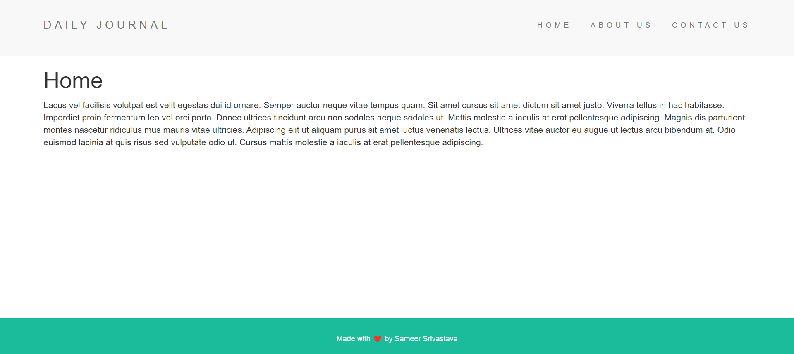

# Blog-Website

Check it out on -> https://warm-lake-12640.herokuapp.com/

# ABOUT
This is a blog website where users can write there daily journals and blogs. To compose a new blog just add /compose in the url. This website is hosted on heroku and the database is hosted on MongoDB Atlas.

# TECHSTACK
Node.Js, CSS, JavaScript, MongoDB
